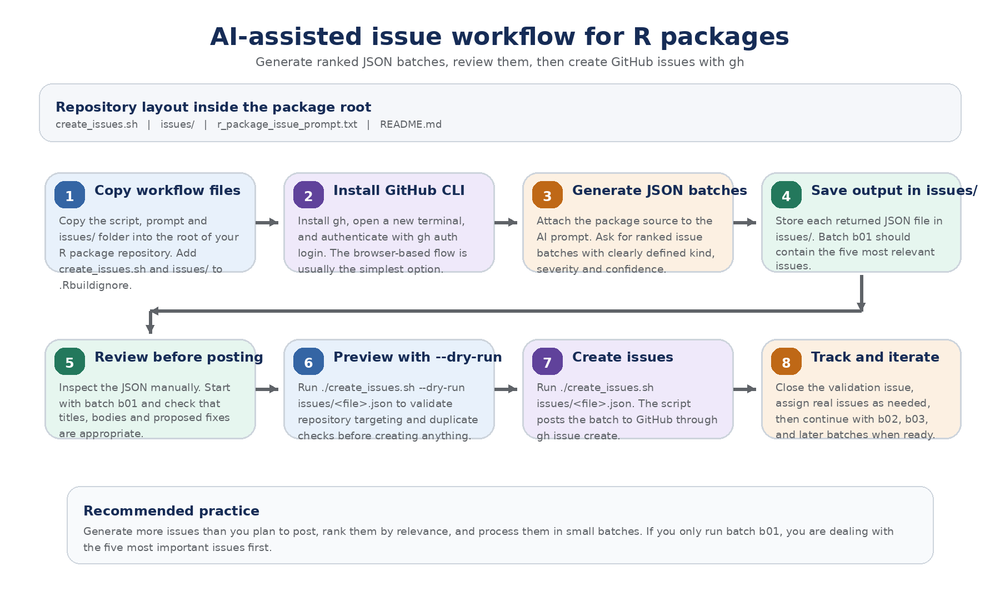
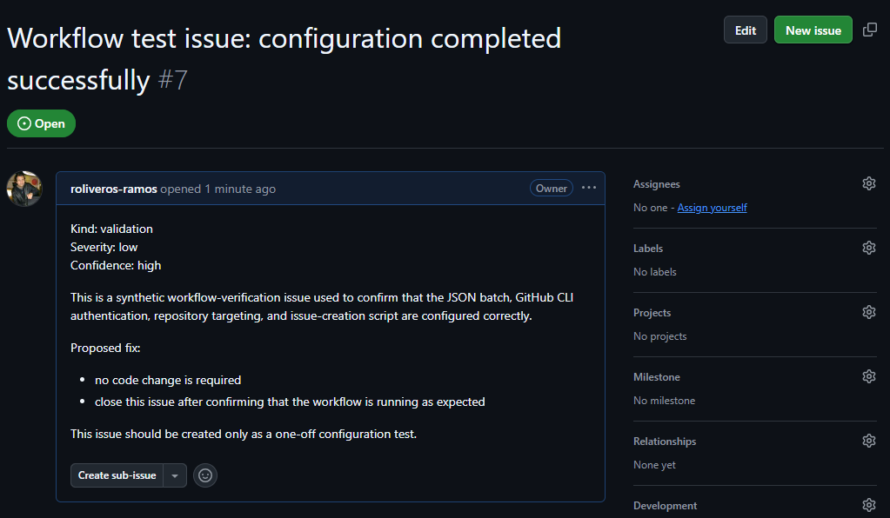

# issueforge

A lightweight workflow for AI-assisted code review that generates prioritised GitHub issue batches from R package source code.



## Purpose of the workflow

This repository provides a simple, reviewable workflow for turning AI-generated code review findings into GitHub issues in manageable batches.

The intended use case is an existing R package repository. You copy the workflow files into the root of your package, generate JSON issue batches with the prompt, review those JSON files manually, and then create the issues with `gh` through a small shell script.

The workflow is designed around a few principles:

- issue generation and issue creation are separate steps
- issues are small, local, and actionable
- batches are limited in size so they are easier to review
- ranked batches make it possible to start with the most important issues first
- generated JSON files remain in the package repository as an audit trail

## Setup of GitHub CLI

Install GitHub CLI (detailed instructions in the last section) and authenticate before running the issue-creation script. The standard authentication flow is:

```bash
gh auth login
```

Then follow the prompts to authenticate to GitHub. Browser-based login is usually the easiest route. GitHub’s quickstart documents `gh auth login` as the standard setup flow, and the `gh auth login` manual documents the token-based alternative. citeturn955958search0turn955958search1

If browser-based login does not work in your environment, a classic Personal Access Token can be used with `--with-token`. The current `gh auth login` manual states that the minimum required scopes for that classic token are `repo`, `read:org`, and `gist`. citeturn955958search1turn955958search2

A quick verification is:

```bash
gh --version
gh auth status
```

## Structure of the repository

In the basic workflow, the contents of this repository are copied into the root of an R package repository.

Recommended layout:

```text
.
├── create_issues.sh
├── issues/
│   └── workflow-check_issues_R.json
├── r_package_issue_prompt.txt
```

### Where files should live

- `create_issues.sh` goes in the root of the package repository
- `issues/` lives inside the package repository and stores generated JSON batches
- `r_package_issue_prompt.txt` contains the reusable prompt used to generate the JSON batches

New JSON files generated with AI should be copied into `issues/`.

Keeping `issues/` inside the package repository is useful because it preserves a record of the review batches that were generated and, potentially, posted.

### `.Rbuildignore`

Because this workflow is part of repository maintenance rather than the package itself, add both the script and the `issues/` directory to `.Rbuildignore`.

For example:

```text
^create_issues\.sh$
^issues$
```

You may also want to ignore other workflow files depending on how you organise the repository, for example the prompt file.

## How to run the script

The script is designed to be run from the root of the package repository.

### Test workflow using the validation JSON

A synthetic validation batch is included so you can confirm that authentication, repository targeting, and issue creation all work before generating real issues.

Run:

```bash
./create_issues.sh issues/workflow-check_issues_R.json
```

This should create one synthetic issue in the target repository.

### Dry run

Before creating real issues, it is a good idea to preview the batch:

```bash
./create_issues.sh --dry-run issues/workflow-check_issues_R.json
```

Use the same pattern for real batches placed in `issues/`:

```bash
./create_issues.sh --dry-run issues/gts_issues_R_2026-03-19_b01_n05.json
./create_issues.sh issues/gts_issues_R_2026-03-19_b01_n05.json
```

If you are not running the script from a local clone already connected to the correct GitHub repository, pass the repository explicitly:

```bash
./create_issues.sh issues/gts_issues_R_2026-03-19_b01_n05.json owner/repo
```

## Expected output

Successful execution of the validation batch should create a synthetic issue confirming that the workflow is configured correctly.



This issue is only a one-off configuration test. Once confirmed, it can be closed.

## How to generate JSON batches

JSON batches are generated outside the script, using the prompt in `r_package_issue_prompt.txt` together with the source code of the target R package.

The intended workflow is:

1. open your preferred AI tool
2. attach the package source code
3. provide the prompt from `r_package_issue_prompt.txt`
4. set the configuration block at the bottom of the prompt
5. review the generated output
6. save each returned JSON batch into `issues/`
7. run `create_issues.sh` on the desired batch

### Important batching rule

The prompt is designed so that:

- issues are ranked by relevance before batching
- each JSON file contains at most 5 issues
- batch `b01` contains the 5 most relevant issues
- batch `b02` contains the next 5 issues
- batch `b03` contains the next 5 issues, and so on

This makes it possible to run only the first batch if you want to start with the highest-priority findings.

### Example filenames

```text
gts_issues_R_2026-03-19_b01_n05.json
gts_issues_R_2026-03-19_b02_n05.json
gts_issues_R_2026-03-19_b03_n03.json
```

## Brief explanation of the prompt

The prompt is designed for source-code inspection of R packages, with an emphasis on small, local, actionable issues that can be verified directly from the code.

It asks the AI to focus mainly on the `R/` directory and to report only issue types that are useful for direct triage, namely:

- `bug`
- `robustness`
- `validation`
- `api-consistency`
- `safe-refactor`

The prompt also requires each issue to include:

- kind
- severity
- confidence
- file path
- function name
- a short, concrete title
- a concise body with a proposed fix

The output format is constrained so the results can be copied directly into JSON files and processed by `create_issues.sh`.

At the bottom of the prompt, `MAX_TOTAL_ISSUES` controls the total number of issues to return. The prompt then splits them automatically into files of at most 5 issues each, preserving ranked order across batches.

## Recommended workflow in practice

A practical routine is:

1. generate a ranked set of JSON batches
2. review the first batch manually
3. run the script in `--dry-run` mode
4. create the issues for batch `b01`
5. decide whether to continue with `b02`, `b03`, and so on

This keeps the workflow conservative and reduces the chance of overwhelming maintainers with too many AI-generated issues at once.

## Notes

- Review the JSON before posting issues.
- Prefer creating issues in small batches.
- Keep titles stable and specific to support duplicate checking.
- Store generated JSON files in `issues/` so the review trail remains visible in the repository.

## Installing GitHub CLI (Command Line Interface)

Install GitHub CLI before running the issue-creation script.

### Windows

The option that worked for me was **Chocolatey**:

```bash
choco install gh
```

Other Windows options are available as well.

Official options:

- WinGet:

```bash
winget install --id GitHub.cli
```
- Download the precompiled Windows binaries (`.exe` / `.msi`) from the GitHub CLI releases page.

Other package-manager routes:

- Scoop:

```bash
scoop install gh
```
- Conda:
```bash
conda install gh --channel conda-forge
```

After installation, open a new terminal window before testing `gh --version`, because the installer may update your `PATH`.

### macOS

On macOS, the simplest route is Homebrew:

```bash
brew install gh
```

You can also download the macOS installer from the GitHub CLI site.

### Linux

On Linux, install `gh` using the method appropriate for your distribution. Examples include:

```bash
sudo pacman -S github-cli    # Arch
sudo dnf install gh          # Fedora
sudo zypper install gh       # openSUSE Tumbleweed
```

For other distributions, follow the official Linux installation instructions.

### Verify the installation

Check that `gh` is available:

```bash
gh --version
```

Then authenticate:

```bash
gh auth login
```

The default authentication mode is the browser-based flow.

## Create a GitHub CLI token

Browser-based authentication with `gh auth login` is usually the simplest option. If you need a token instead, use a **Personal Access Token (classic)** for this workflow. The current `gh auth login` manual states that the minimum required scopes are:

- `repo`
- `read:org`
- `gist`

### Shortcut

You can go directly to the token page here:

https://github.com/settings/tokens

### Create the token

1. In GitHub, go to **Settings**.
2. Open **Developer settings**.
3. Under **Personal access tokens**, click **Tokens (classic)**.
4. Click **Generate new token**, then **Generate new token (classic)**.
5. Give the token a descriptive name, choose an expiration date, and select these scopes:
   - `repo`
   - `read:org`
   - `gist`
6. Generate the token and copy it somewhere safe. GitHub shows the token value only once.

### Authenticate GitHub CLI with the token

A simple pattern is:

```bash
gh auth login --with-token < mytoken.txt
```

where `mytoken.txt` contains only the token.

### Notes

- GitHub generally recommends **fine-grained** personal access tokens where possible, but for this GitHub CLI workflow a **classic** token is the straightforward option because `gh auth login --with-token` documents classic-token scopes directly.
- If your organisation uses **SAML SSO**, you may also need to authorise the token for that organisation after creating it.
